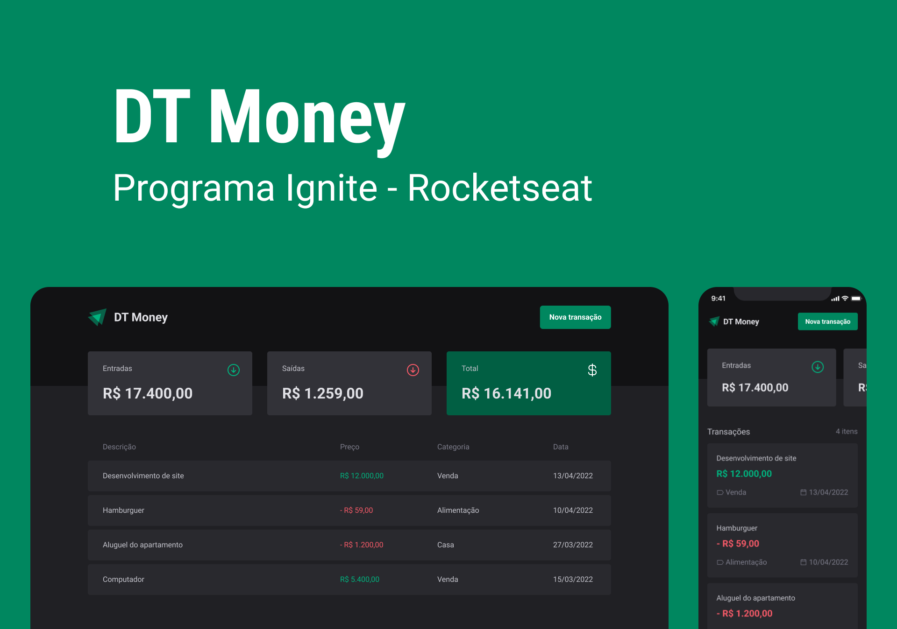

<h1 align="center"> Dtmoney </h1>

   An enhanced version of dtmoney, a financial manager app create with ReactJs

  <a href="#-tecnologias">Technologies</a>&nbsp;&nbsp;&nbsp;|&nbsp;&nbsp;&nbsp;
  <a href="#-projeto">Project</a>&nbsp;&nbsp;&nbsp;|&nbsp;&nbsp;&nbsp;
  <a href="#memo-licença">License</a>

  

 

  

## 🚀 Tecnologies

This project was made with the following technologies:

- ReactJs & Typescript
- Styled Components
- Git e Github

## 💻 Project

Dtmoney is a financial manager app created with ReactJs on the Ignite Course by Rocketseat

## 📝 License

This project is under the MIT license

---

Made with ♥ by João Gabriel